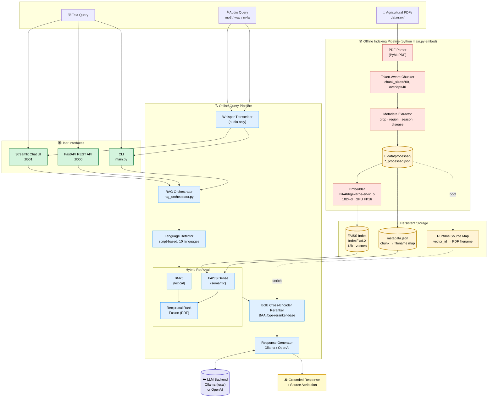
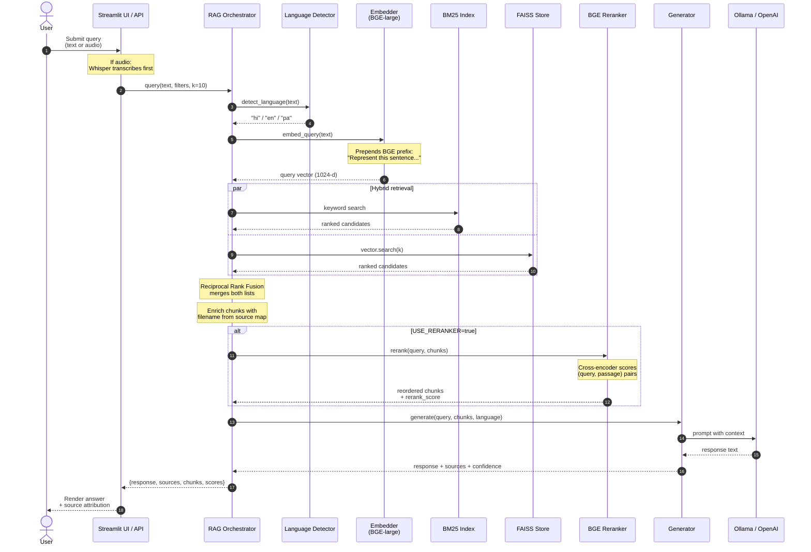
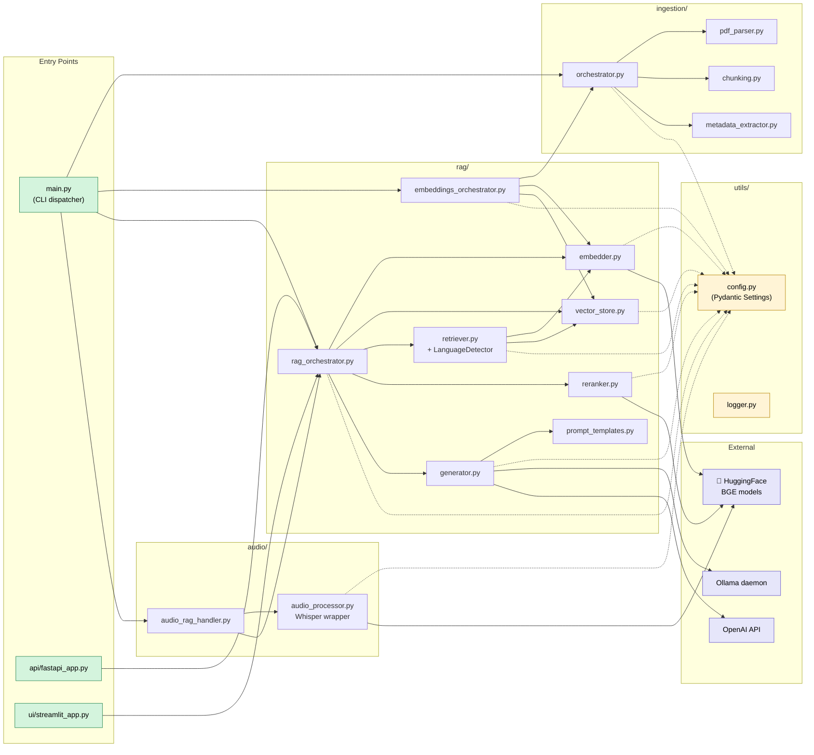
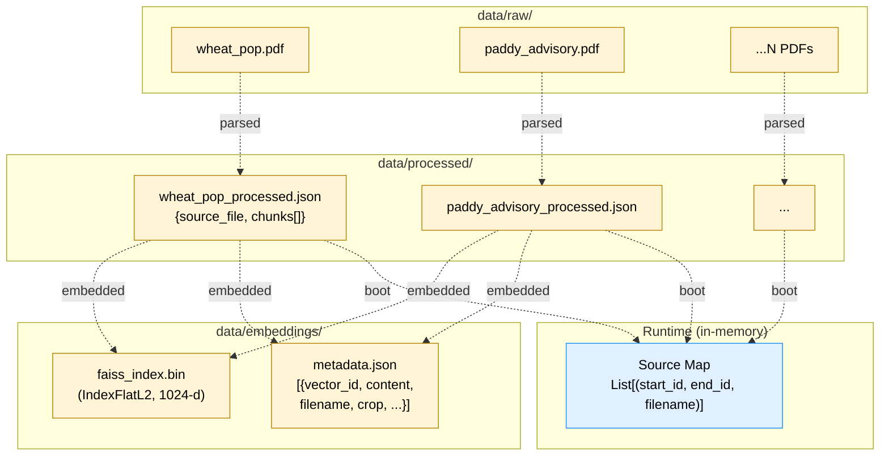

# Architecture

This document describes the system architecture of the Agricultural RAG System using Mermaid diagrams (renders inline on GitHub).

---

## 1. System Overview

End-to-end view of the offline indexing pipeline and the online query pipeline. The two pipelines meet at the **FAISS vector store + metadata index**.

---

## 2. Query Lifecycle (Sequence Diagram)

Runtime flow when a user submits a query. Shows how the RAG orchestrator coordinates the retriever, reranker, and generator.

---

## 3. Module Layout

Internal module dependencies — which Python packages call which.

---

## 4. Data Storage Layout

What lives on disk and how it relates.

---

## Key Design Decisions

| Decision | Rationale |
|----------|-----------|
| **Two-stage retrieval** (hybrid then rerank) | Bi-encoder is fast over large corpora; cross-encoder is accurate but slow — restrict it to the top-`k` candidates. |
| **BM25 + Dense + RRF** | Lexical search catches exact terminology (chemical names, dosages, variety codes); semantic search handles paraphrases. RRF merges without tuning weights. |
| **BGE over multilingual MiniLM** | bge-large-en-v1.5 is ~3× the dimensions (1024 vs 384) and trained on a much larger corpus. For agricultural English text it consistently retrieves better; Hindi/Punjabi queries still work through transliterated/translated terms. |
| **Native HF Transformers for BGE** | SentenceTransformers wraps BGE incorrectly (uses `pooler_output`); we need the CLS token from `last_hidden_state[:, 0, :]` for retrieval-tuned BGE checkpoints. |
| **Runtime source map** | Avoids re-embedding when filename data was missing from older builds. The map is rebuilt from `data/processed/*.json` on startup. |
| **FAISS IndexFlatL2 (not IVF/HNSW)** | At ~12k vectors the corpus is small enough that exact search is sub-millisecond. No recall trade-off, no index-build complexity. |
| **Pydantic Settings** | Single source of truth for config across modules; auto-loads from `.env`; type-validated at startup so misconfiguration fails fast. |
